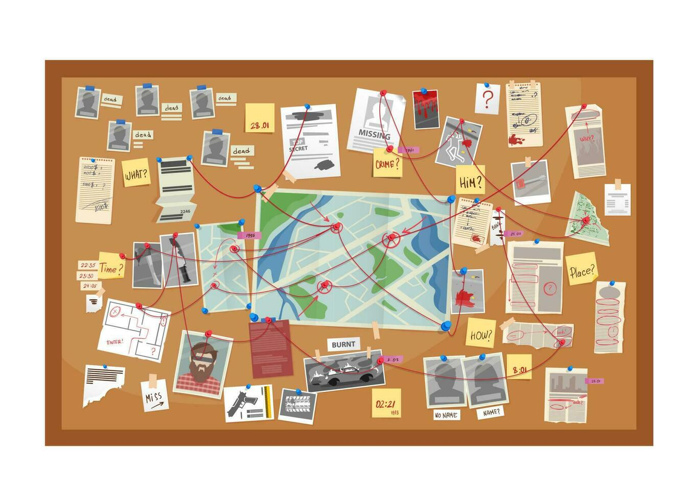

# Data-Driven Prediction of U.S. Crime Incidents

  

## 📄 Overview
This project focuses on leveraging the **"Crime Data from 2020 to Present"** dataset provided by the Los Angeles Police Department (LAPD), accessible at [Data.gov](https://catalog.data.gov/dataset/crime-data-from-2020-to-present).  

The objective is to perform **comprehensive data cleaning and preprocessing**, exploratory data analysis (EDA), and the development of **machine learning models** for **classification** and **regression tasks**. The end goal is to achieve **optimal predictive performance** and extract meaningful insights to understand crime patterns across the U.S.

---

## 🧰 Technologies Used
- **Languages:** Python  
- **Libraries & Tools:** Pandas, NumPy, Matplotlib, Seaborn, Scikit-learn, LightGBM  
- **ML Models:** Logistic Regression, Decision Tree Classifier, LightGBM Classifier  
- **Other:** Jupyter Notebook

---

## 🗂️ Dataset
- **Source:** [Data.gov LAPD Crime Dataset](https://catalog.data.gov/dataset/crime-data-from-2020-to-present)  
- **Description:** Comprehensive dataset of crime incidents from 2020 to present, including attributes such as crime type, location, date/time, and victim details.  
- **Goal:** Build predictive models to classify and understand crime trends, and analyze patterns for insights into prevention and resource allocation.

---

## 🚀 Workflow
1. **Data Cleaning & Preprocessing:**  
   - Removed irrelevant and duplicate columns  
   - Handled missing values and standardized data formats  
   - Encoded categorical variables for model compatibility  

2. **Exploratory Data Analysis (EDA):**  
   - Generated plots to explore relationships between features and target variables  
   - Visualized crime trends over time, locations, and demographic distributions  

3. **Feature Engineering:**  
   - Selected relevant features to improve model performance  
   - Applied dimensionality reduction where necessary  

4. **Modeling & Evaluation:**  
   - Built and trained **Logistic Regression** and **Decision Tree Classifier**  
   - Evaluated performance using Accuracy, Precision, Recall, F1-Score, and ROC-AUC metrics  

5. **Visualization & Insights:**  
   - Plotted confusion matrices and ROC curves for model comparison  
   - Extracted insights on crime trends and key predictive factors

---

## 📊 Classification Model Performance

| Model               | Accuracy | Precision | Recall  | F1-Score | ROC-AUC |
|--------------------|---------|-----------|---------|----------|---------|
| Logistic Regression | 0.770   | 0.601     | 0.770   | 0.670    | 0.701   |
| Decision Tree       | 0.778   | 0.711     | 0.778   | 0.723    | 0.745   |

**Insights:**  
- **Decision Tree Classifier** outperforms Logistic Regression across all metrics, capturing some non-linear relationships in the dataset.  
- Logistic Regression serves as a strong baseline but struggles with complex patterns.  
- The model highlights crime hotspots, frequent offense types, and demographic patterns that can inform policy decisions.

---

## 📁 Repository Structure
- `data/` – Contains dataset placeholders or links to original dataset  
- `notebooks/` – Jupyter Notebook with full analysis and model implementation  
- `visuals/` – Figures, plots, and charts generated during EDA and modeling  
- `README.md` – Project overview, methodology, and results

---

## 🔗 References
- LAPD Crime Dataset: [Data.gov](https://catalog.data.gov/dataset/crime-data-from-2020-to-present)  
- Scikit-learn documentation: [https://scikit-learn.org](https://scikit-learn.org)  

---

✨ *Data-driven insights for safer communities.*
